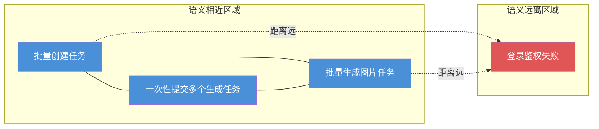
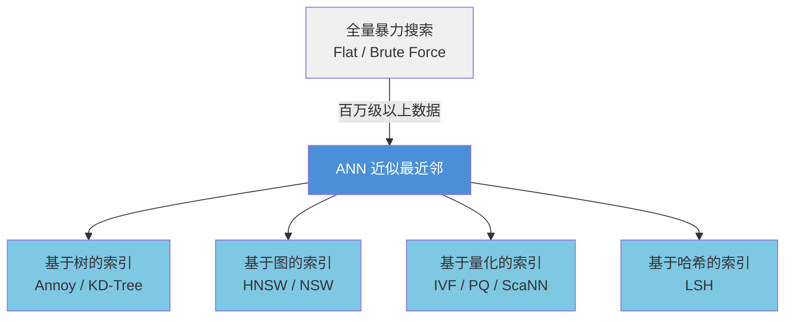
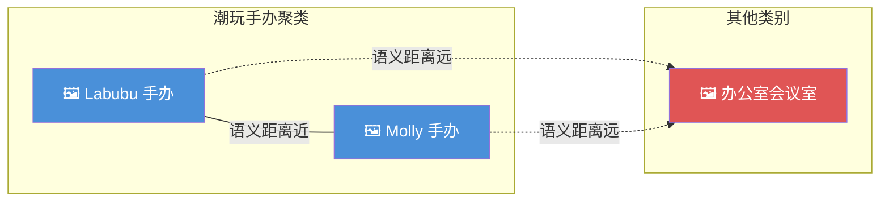
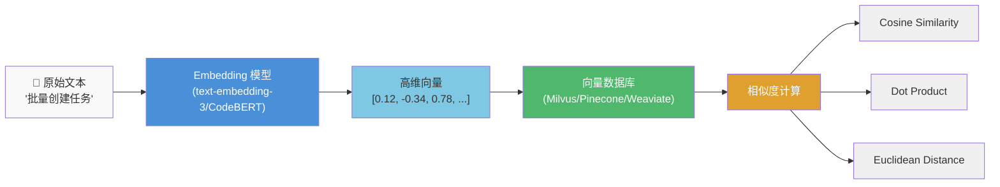
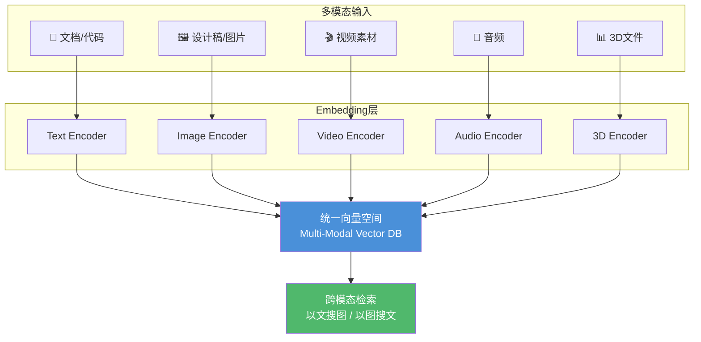
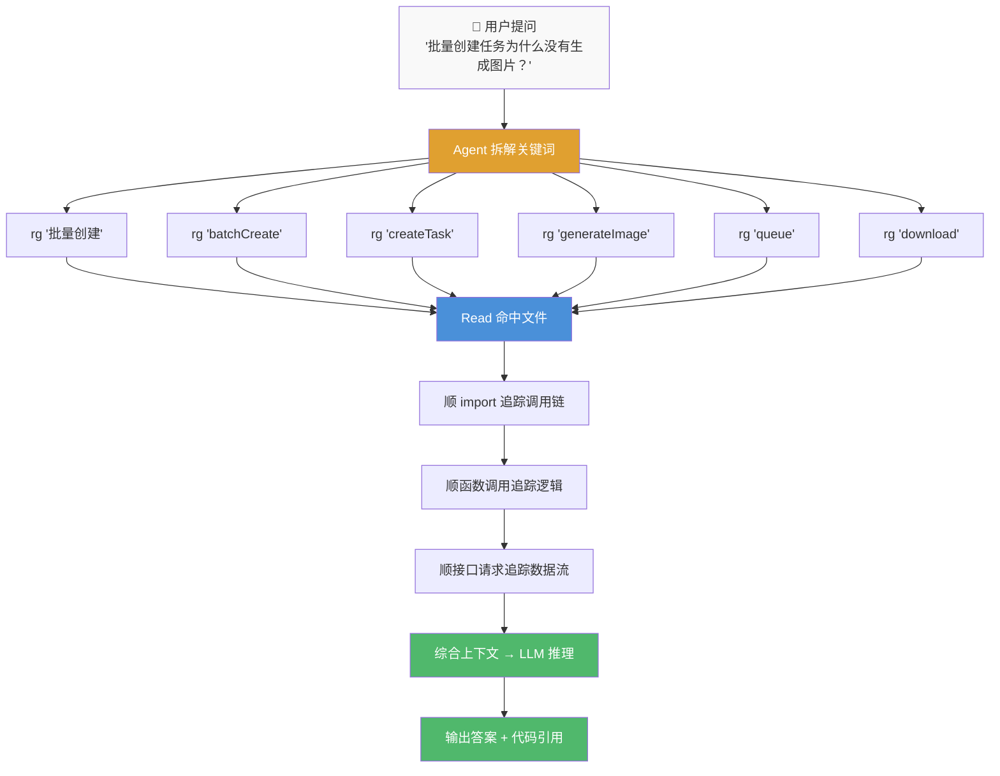
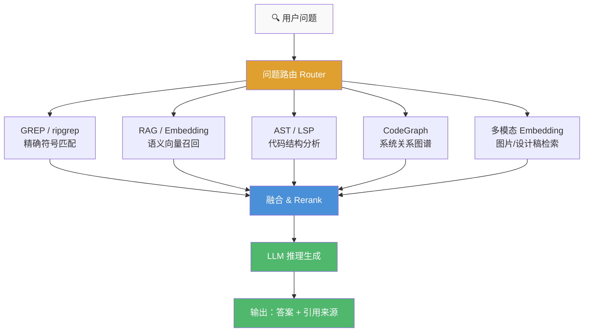
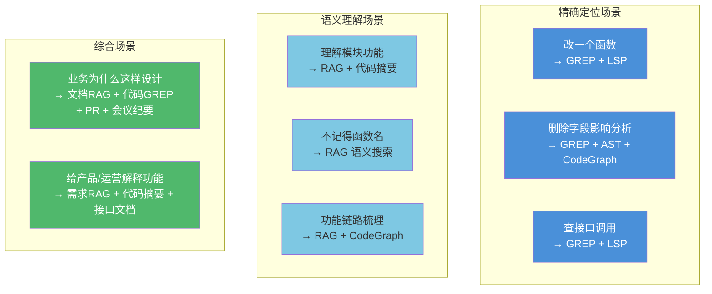
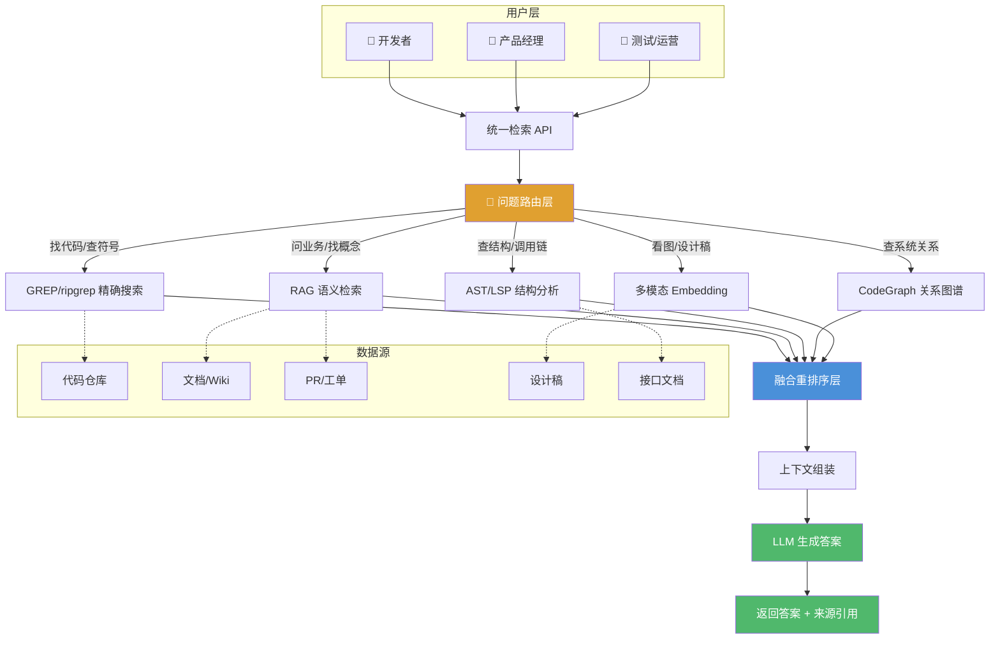
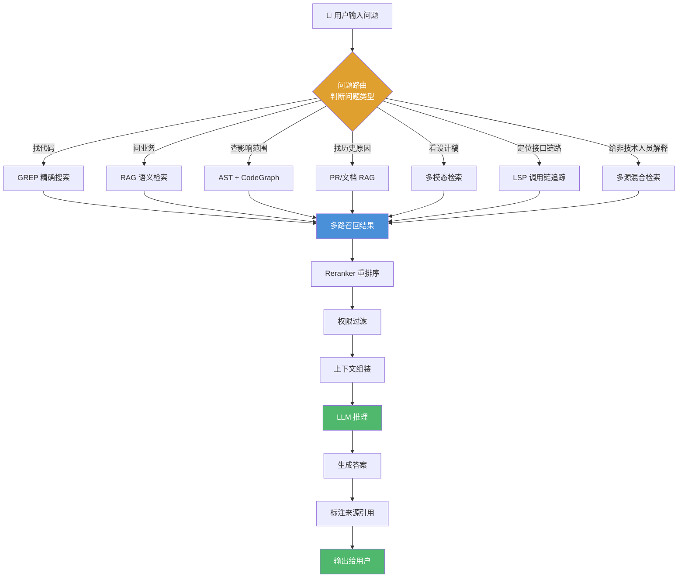

+++
date = '2026-07-12T19:17:03+08:00'
draft = false
title = '从 RAG 到 Hybrid Retrieval 的 AI 代码检索架构'
categories = ['Vibe Coding']
tags = ['Vibe Coding', 'AI', 'Code Retrieval']
description = '从 GREP 到 RAG，详解 AI 代码检索的两条路线与 Hybrid Retrieval 架构。'
+++

<!--more-->

Hybrid Retrieval（混合检索）：同时使用两种及以上不同逻辑的检索方式，分别召回候选内容，再融合、重排结果，取长补短，从而弥补单一检索的短板。

放在代码 AI 场景里，就是精确符号检索（GREP/LSP/AST）+ 语义向量检索（RAG Embedding）两套体系协同工作。

---

AI 时代，检索不再只是搜索关键词。

过去我们做搜索，问题通常很简单：这个关键词在哪里？这个函数在哪里定义？这个接口在哪里被调用？这个报错来自哪一行？

但进入 AI 时代之后，问题变复杂了。我们不只是想找某个词，而是想让 AI 理解一个系统：

- 这个需求涉及哪些代码？
- 这个功能的完整链路是什么？
- 这个字段删除会影响哪些系统？
- 这个业务逻辑为什么这样设计？
- 需求文档、代码、接口、PR、测试用例之间有没有对应关系？
- 我不知道准确函数名，只知道它大概是处理批量任务的——能不能帮我找到？



这些问题背后，对应着两种完全不同的检索方向：一种是 GREP 式检索，一种是 RAG 式检索。

GREP 代表精确匹配——它关心的是：这个字符串、正则、函数名、接口路径、错误码、字段名，到底在哪里出现过。

RAG 代表语义召回——它关心的是：哪些内容和我的问题在语义上相关，即使它们没有出现完全相同的关键词。

这两种方式在 AI 时代都很重要。它们不是替代关系，而是互补关系。更准确地说：

- **GREP** 找精确证据。
- **RAG** 找语义背景。
- **AST / LSP** 找代码结构。
- **CodeGraph** 找系统关系。
- **多模态 Embedding** 连接图片、设计稿和业务资产。
- **LLM** 负责把这些上下文推理成答案。

这也是为什么真正成熟的 AI 编程工具和企业知识系统，最终都会走向 Hybrid Retrieval。

## 一、先说结论：GREP 和 RAG 不是一个维度的东西



很多人会把 GREP 和 RAG 放在一起比较，然后问：AI 时代到底应该用哪个？

这个问题本身有点误导——因为 GREP 和 RAG 解决的不是同一种问题。

GREP 的核心是**字面匹配**（更像一个确定性定位器）；RAG 的核心是**语义召回**（更像一个语义雷达）。

当你知道自己要找什么时，GREP 非常强。比如你明确知道函数名是 `createPrompt`、接口路径是 `/api/prompt/create`、字段名是 `projectId`、错误信息是 `Cannot read properties of undefined`——这时用 GREP、ripgrep、IDE 全局搜索，通常最快、最准、最可解释。

但如果你不知道准确关键词，只知道大概意思，比如：

- "提示词版本对比相关逻辑在哪里？"
- "批量创建任务的完整链路是什么？"
- "这个页面和项目维度的提示词管理有什么关系？"
- "以前有没有做过类似的 AI 生成任务队列？"

这时 RAG 更有价值。它可以根据语义相似度，把相关文档、代码注释、需求说明、历史 PR、Wiki、测试用例全部召回出来。

一句话区分：

> 你知道要找什么，用 GREP。你只知道大概意思，用 RAG。

不过在真实工程里，最好的答案往往不是二选一，而是：先用 RAG 找方向，再用 GREP 找证据，最后用 AST/LSP/CodeGraph 验证结构关系。

## 二、为什么 Claude Code 看起来更偏爱 GREP？

很多人注意到，Claude Code 在代码库探索时大量使用 Grep、Glob、Read、Bash 这类工具。这不是偶然，而是代码场景本身决定的。

代码和普通文档不一样。代码天然有大量稳定、精确、可定位的结构：函数名、变量名、类型名、组件名、接口路径、数据库字段、错误码、日志关键词、import 路径、package 名称、文件路径、配置项……这些东西不需要"语义猜测"，直接搜反而更可靠。

比如你要查一个前端项目里的提示词管理模块，最有效的第一步可能不是做向量检索，而是：

```bash
rg "Prompt"
rg "PromptManager"
rg "projectId"
rg "createPrompt"
rg "/prompt"
rg "version"
rg "版本对比"
```

这类搜索结果的好处是**非常明确**：命中了就是命中了。你能看到具体文件、具体行号、具体上下文。模型拿到这些结果之后，再继续读文件、找引用、看调用链、运行测试，就能逐步建立理解。

这也是 Claude Code 这类编码代理重视 GREP 的原因。

在代码修改任务里，AI 最怕的不是"没有想法"，而是"上下文不真实"。如果模型根据语义相似度召回了一堆看似相关但实际无关的代码，很容易产生错误判断。相比之下，GREP 给的是硬证据：

- 某个函数是否真的被调用。
- 某个字段是否真的存在。
- 某个接口路径是否真的被请求。
- 某个错误码是否真的被抛出。
- 某个组件是否真的被引用。
- 某个 feature flag 是否真的开启。

这些问题，用 GREP / ripgrep / LSP 通常比纯向量检索更可靠。

所以，Claude Code 偏爱 GREP，不代表 RAG 没用，而是说明**在代码编辑和代码定位场景里，精确命中比语义相似更重要**。

## 三、OpenAI、Cursor、Sourcegraph 是不是也一样？

不是完全一样，但大方向正在收敛。行业里大致形成了两类产品路线。



**第一类是 Agentic Coding Tool（编码代理工具）**。典型代表包括 Claude Code、OpenAI Codex、Gemini CLI。它们的核心任务是进入真实代码仓库，读文件、搜代码、改代码、跑命令、验证结果。这类工具更重视本地工具调用、文件系统搜索、GREP、Shell、测试运行、Git diff——因为它们要解决的是"我现在要在这个仓库里完成一个具体任务"。

**第二类是 Codebase Knowledge / IDE Indexing Tool（代码库知识索引工具）**。典型代表包括 Cursor、Sourcegraph Cody。这类工具更强调长期理解一个 workspace 或多个仓库，需要持续索引代码、文档和上下文，因此更容易引入 embedding、向量索引、语义搜索和 RAG。

所以不是"Claude 选 GREP，OpenAI 选 RAG，Cursor 选向量"。更准确的说法是：

> 编码代理偏确定性工具调用，代码库知识系统偏长期语义索引，企业级研发智能体最终走混合检索。

具体来看各家产品的差异：

**Claude Code：Agent 临场探索代码库。** Claude Code 的工具体系里，Grep、Glob、Read、Bash 等工具非常关键。这说明它不是在回答前预先将一切都向量化，而是在任务执行过程中动态探索代码库。它的行为更像一个工程师：先搜关键词，再打开相关文件，沿着调用链继续找，然后修改代码，跑测试验证，最后给出结论。这种方式非常适合代码修改、Bug 修复、功能迭代，因为它依赖的是代码现场，而不是一个可能过期的索引。

**OpenAI Codex：同样重视本地代码环境和工具调用。** OpenAI Codex CLI 的定位也是运行在本地电脑上的 coding agent，能读代码、改代码、运行命令，在真实项目环境里完成任务。这类工具通常也不会只依赖 RAG，因为代码修改任务必须面对真实文件、真实依赖、真实命令输出和真实测试结果。不过 OpenAI 在不同产品形态中使用了不同工具：Coding Agent 场景更重视文件、Shell、搜索、执行验证；知识问答场景更重视 RAG、Embedding、Vector Store；企业知识场景更重视检索、权限、引用和可追溯。

**Cursor：更典型的长期代码库索引。** Cursor 是 IDE 形态，长期运行在开发者 workspace 里，天然适合维护一个代码库索引。当文件变化时，它会将文件切成语法级 chunk，再将这些 chunk 转成 embedding 用于语义搜索——由于生成 embedding 成本较高，所以异步处理并缓存未变化的 chunk。这就是非常典型的代码 RAG 思路。它适合解决的问题不是"这个字符串在哪里"，而是"这个代码库里和某个概念相关的地方有哪些？""我不记得函数名但知道业务含义，能不能找到？""当前编辑文件和整个项目上下文有什么关系？"——它的优势在于长期上下文。

**Sourcegraph Cody：RAG + Code Search 的组合。** Sourcegraph 本身是做代码搜索起家的，强项是跨仓库代码搜索、关键词搜索、正则搜索和结构化过滤。Cody 在此基础上接入 LLM，通过检索相关上下文来帮助模型回答代码问题。这很符合企业级场景——企业代码库不是一个简单项目，而是很多仓库、很多服务、很多语言、很多历史包袱。单靠 GREP 不够，因为你不知道该搜什么；单靠 RAG 也不够，因为你需要精确证据。所以 Sourcegraph 的路线本质上是：Code Search 负责精确定位，RAG 负责上下文召回，LLM 负责理解和生成，权限系统控制可见范围，跨仓库索引连接大型工程体系。这也是企业内部 RepoWiki 最应该参考的方向。

## 四、行业选型的真实趋势：不是 RAG vs GREP，而是按任务分层



可以用这张表总结：

| 产品 / 公司 | 更明显的技术倾向 | 背后原因 |
|---|---|---|
| Claude Code | GREP / Glob / Read / Shell | Agent 进入真实仓库，精确定位代码最重要 |
| OpenAI Codex | 本地工具调用 + 文件搜索 + 执行验证 | 读、改、跑代码，需要确定性证据 |
| Cursor | 代码库 embedding 索引 + IDE 上下文 | 长期 workspace，需要语义理解和快速召回 |
| Sourcegraph Cody | RAG + Code Search + 语义搜索 | 面向企业大代码库和跨仓库知识检索 |
| 企业内部 RepoWiki | Hybrid Retrieval | 既要找代码证据，也要理解业务背景 |

各家公司虽然路线不完全一致，但底层判断越来越统一：代码修改 Agent 偏 GREP，代码库问答偏 RAG，企业级研发智能体走 Hybrid。

这背后其实是任务形态不同：

- 如果任务是"改一个函数"，你需要精确上下文。
- 如果任务是"理解一个模块"，你需要语义背景。
- 如果任务是"判断影响范围"，你需要结构关系。
- 如果任务是"回答业务为什么这么设计"，你需要文档、PR、需求和历史上下文。
- 如果任务是"给产品、测试、运营做一个业务助手"，你需要把代码、文档、图片、流程、任务结果都串起来。

这就是 Hybrid Retrieval 的价值所在。

## 五、RAG 到底是什么？

RAG 的全称是 Retrieval-Augmented Generation，中文通常叫检索增强生成。



它的核心思想很简单：**不要让大模型只依赖自己参数里的知识，而是在回答之前，先从外部知识库检索相关资料，再把这些资料作为上下文交给模型生成答案。**

大模型本身当然有知识，但它有几个天然限制：它不知道你的私有代码，不知道你公司内部文档，不知道你今天刚改的需求，不知道某个接口刚刚废弃，不知道某个历史方案为什么被否掉，也没法每次把整个公司的所有代码和文档都塞进上下文窗口。

RAG 的价值，就是给模型外接一个可检索、可更新、可追溯的知识系统。

很多人会把 RAG 简单理解成"向量数据库"，但这其实不准确。向量数据库只是 RAG 的一部分。完整的 RAG 至少包括：数据接入、数据清洗、文本切块、Embedding、向量索引、元数据过滤、召回策略、Rerank、上下文拼接、答案生成、来源引用、权限控制、增量更新。

所以，RAG 的本质不是"我有一个向量库"，而是：

> 我有一套能让大模型访问外部知识的上下文工程系统。

## 六、向量索引是怎么工作的？



要理解 RAG，必须先理解向量索引。

Embedding 模型会把一段文本、一段代码甚至一张图片，转换成一个高维数字数组，这个数组就是向量。你可以把向量理解成**内容在语义空间里的坐标**。

比如这三句话：

- "批量创建任务"
- "一次性提交多个生成任务"
- "批量生成图片任务"

它们字面不完全一样，但语义接近。Embedding 模型会把它们映射到比较接近的位置。

而"登录鉴权失败"与"批量创建任务"语义不同，在向量空间里的距离就会更远。



> 图：语义相似内容在向量空间中的距离关系

检索时，用户的问题也会被转换成向量，系统拿这个查询向量去向量库里找距离最近的内容。常见的相似度计算包括：

- **Cosine Similarity**：看两个向量方向是否接近。
- **Dot Product**：看两个向量点积大小。
- **Euclidean Distance**：看两个点在空间里的距离。

真实业务里，向量数量可能非常大——几十万、几百万、几千万都很常见。如果每次都暴力计算所有向量的距离，成本会非常高。因此向量数据库通常会使用 **ANN（Approximate Nearest Neighbor，近似最近邻搜索）**，通过索引结构快速找到足够接近的候选结果。

常见索引包括：



> 图：向量数据库中常见的ANN索引结构

在企业应用中，单纯向量检索通常还不够。因为业务检索不只是"语义相似"，还要考虑权限、项目、模块、时间、负责人、仓库、分支、文档类型等维度。

所以一个真实的 RAG 查询流程可能是这样的：

1. 先根据用户问题做 embedding。
2. 再按项目、权限、文档类型过滤。
3. 再做向量相似度检索。
4. 再混合关键词召回结果。
5. 再用 reranker 重排。
6. 最后把最相关的上下文交给模型。

这才叫生产级 RAG。

## 七、从图片向量化理解 Embedding



很多人第一次接触向量检索时，会觉得"把文本变成一串数字"很抽象。其实可以先从图片理解。

假设我们有三张图片：一张是 Labubu 手办，一张是 Molly 手办，一张是办公室会议室。如果用图像 embedding 模型处理它们，模型不会只是记住文件名，而是会把图片里的视觉特征编码成向量——比如颜色、形状、物体、风格、构图、主体类别。

结果可能是：Labubu 和 Molly 都是潮玩手办，它们在向量空间里距离更近；会议室图片和它们差异很大，所以距离更远。



> 图：不同类型图片在语义向量空间中的分布

如果用户搜索"潮玩手办"，系统即使没有看到完全一样的文件名，也能找到 Labubu、Molly 这类图片，因为它们在视觉语义空间里更接近。

文本 RAG 也是类似的逻辑。



> 图：文本通过Embedding转换为向量并计算相似度

这个例子可以帮助我们理解一个关键点：**向量不是为了让机器记住原文，而是为了让机器能计算相似性。**

图片、文本、代码、视频、音频，本质上都可以通过不同的 encoder 转换成向量。区别在于模型不同、输入模态不同，但目标一致：把原始内容映射到一个可计算相似性的空间里。

这也是为什么多模态知识库会越来越重要。未来企业知识不只是文档和代码，还包括：设计稿、商品图、运营海报、视频素材、生成任务结果、模型效果对比图、3D 文件、包装图、创意素材、用户反馈截图。这些内容靠 GREP 搜不到，靠传统文本 RAG 也不够，它们需要多模态 embedding。



> 图：多模态Embedding支持的多样化业务资产检索

对企业来说，这会把 RAG 从"文档问答系统"升级成"业务资产检索系统"。

## 八、为什么 AI 时代需要 RAG？

RAG 在 AI 时代变得重要，不是因为向量数据库火了，而是因为大模型本身有天然边界。

**1. 模型不知道你的私有知识。** 公司的代码、业务流程、内部文档、需求背景、会议纪要、接口定义、事故复盘——这些都不在通用模型参数里。你不检索出来，模型只能猜。

**2. 模型知识无法实时更新。** 模型训练完成后，参数知识就固定了。但业务每天都在变：今天改了接口，明天废弃字段，下周调整流程，某个分支刚合并，某个功能刚灰度，某个模型刚切换。这些最新知识必须通过外部检索注入。

**3. 上下文窗口再大也不够。** 即使模型上下文越来越长，也不可能每次把整个公司所有代码、文档、PR、工单、图片全部塞进去。RAG 的作用是先筛选，再交给模型。

**4. 企业场景需要可追溯。** AI 不能只是说"我觉得"。它需要告诉你：答案来自哪个文档，对应哪段代码，引用哪个 PR，涉及哪个接口，影响哪些模块，有没有过期风险。RAG 可以把来源一起返回，让答案可验证。

**5. 业务知识不是纯代码。** 很多关键问题不能只看代码。比如：为什么这里要走异步队列？为什么这个功能先隐藏？为什么模型默认切到某个版本？为什么这个字段不能直接删？这些答案经常藏在需求文档、PR 讨论、会议纪要、产品说明和历史方案里。

GREP 能找到代码，RAG 才能找到背景。

## 九、为什么 GREP 在 AI 时代反而更重要？

AI 时代来了，关键词搜索是不是就落后了？不是。

恰恰相反，AI 让 GREP 更重要了。过去 GREP 是人用的，现在 GREP 是 Agent 用的。过去你要自己想关键词，现在模型可以帮你拆关键词、搜代码、读文件、继续追踪。

比如用户问："批量创建任务为什么没有生成图片？"一个好的 Agent 可能会自动拆成：

```bash
rg "批量创建"
rg "batchCreate"
rg "createTask"
rg "generateImage"
rg "queue"
rg "download"
rg "wan"
```

然后它会继续读命中文件，顺着 import、函数调用、接口请求、状态流转继续追踪。这时 GREP 不再只是一个搜索命令，而是 **Agent 的感知工具**。



> 图：AI编程代理使用GREP作为感知工具的工作流程

GREP 的价值在于**确定性**。它告诉模型：这个函数真的存在，这个字段真的被使用，这个接口真的被请求，这个错误真的被抛出，这个组件真的被引用。这类证据，是代码 Agent 的地基。

## 十、RAG 在代码场景里的问题

RAG 很强，但不是银弹。尤其在代码场景里，传统 RAG 会遇到几个棘手的问题。

**1. 代码切块很难。** 普通文档可以按段落切，但代码不能随便切。如果一个函数被切断、类型定义和使用分离、import 和实现分离，召回质量就会显著下降。更合理的代码切块方式应该基于结构：文件级 chunk、函数级 chunk、class 级 chunk、React component 级 chunk、API handler 级 chunk、service/model/controller 级 chunk、route 级 chunk。

**2. 语义相似不等于代码相关。** 两个代码片段语义相似，不代表它们在调用链上相关。两个项目里都可能有 `createTask`，embedding 可能觉得它们很像，但业务上可能完全无关。

**3. 代码符号容易被弱化。** 像 `usePromptList`、`PromptVersionCompareModal`、`batchCreateTaskQueue` 这种符号，对开发者和编译器至关重要，但 embedding 模型不一定会像 GREP 那样精确处理它们。

**4. 更新成本更高。** 代码变化很快。RAG 系统必须处理：哪些文件变了？哪些 chunk 失效了？哪些向量要删除？哪些索引要更新？哪些摘要要重算？旧答案是否还可信？如果没有增量更新机制，代码 RAG 很容易过期。

**5. 缺少结构理解。** RAG 能告诉你哪些片段语义相关，但它天然不知道谁调用了谁、哪个组件依赖哪个 service、哪个接口被哪些页面使用、哪个字段从后端一路传到前端。这些更适合 AST、LSP、CodeGraph 来解决。

## 十一、最合理的方向：Hybrid Retrieval



真正适合 AI 时代的检索系统，不是 RAG，也不是 GREP，而是 **Hybrid Retrieval**。

也就是把多种检索方式组合起来。



> 图：GREP、RAG、AST、LSP、CodeGraph等技术协同工作

每种技术都有自己的位置：



> 图：不同检索技术在不同场景下的价值定位

一个好的研发智能体，不应该只问"用不用 RAG"，而应该问：**这个问题需要哪种上下文？**

- 如果用户问：`createPrompt` 在哪里被调用？→ 走 GREP + LSP。
- 如果用户问：提示词管理模块是干什么的？→ 走 RAG + 代码结构摘要。
- 如果用户问：版本对比功能下一期怎么接？→ 走需求文档 RAG + 当前代码 GREP + 组件结构分析。
- 如果用户问：删除这个字段会影响哪些系统？→ 走 GREP + AST + CodeGraph + 接口文档 RAG。
- 如果用户问：这个功能为什么历史上没有上线？→ 走需求文档 + PR + 会议纪要 + 任务系统 RAG。

## 十二、面向企业 RepoWiki 的推荐架构

如果要做团队级 RepoWiki 或 AI Coding Knowledge Base，我的建议是：不要只做向量库，也不要只做代码搜索。应该做一个**分层检索架构**。



> 图：企业RepoWiki的分层检索架构设计

这个架构里最关键的是**"问题路由"**。系统要先判断用户的问题属于哪一类：是找代码？是问业务？是查影响范围？是找历史原因？是看设计稿？是定位接口链路？还是给产品、测试、运营解释功能？不同问题走不同的检索路径。

一个更工程化的流程可以是：



> 图：企业级研发智能体的完整检索流程

这样的系统，才适合企业内部长期使用。

## 十三、对前端团队尤其重要的一点：不要只索引代码，要索引业务链路

前端项目经常有一个问题：代码里有功能，但没人知道功能为什么存在；需求文档有背景，但和代码对不上；接口文档有字段，但不知道页面哪里用了；测试知道问题，但不知道对应哪个组件；产品知道业务，但不知道代码实现；新人接手项目，只能全局搜索，然后靠猜。

这时候 RepoWiki 的价值不是"把代码喂给模型"，而是**把业务链路沉淀下来**。

比如一个"提示词管理"模块，系统应该能回答：入口页面在哪里？项目维度如何筛选？提示词如何增删改查？版本能力是否已经实现？版本对比为什么暂时不做？相关接口有哪些？字段从后端到前端如何流转？哪些组件负责展示？哪些 service 负责请求？哪些需求文档提过这个模块？未来扩展点在哪里？

这类问题如果只靠 GREP，能找到代码，但不一定能解释业务。如果只靠 RAG，能找到描述，但不一定能验证实现。如果加上 AST/LSP/CodeGraph，才能把"描述"和"代码"真正连起来。

所以，对团队知识系统来说，真正有价值的不是"AI 搜索"，而是：

> 把散落在代码、文档、接口、设计稿、PR、测试和任务系统里的上下文，组织成可检索、可追溯、可持续更新的业务知识网络。

## 十四、最终结论：不要迷信 RAG，也不要低估 GREP

AI 时代的检索，不是越智能越好，而是**越合适越好**。

GREP 的价值在于**确定性**。它快、准、可解释，非常适合代码、日志、配置、接口、字段、错误码、符号搜索。

RAG 的价值在于**语义召回**。它能处理模糊问题、业务知识、非结构化文档、跨资料背景，适合构建企业知识助手。

Claude Code 偏爱 GREP，并不是因为 RAG 没用，而是因为在代码编辑和代码定位场景里，精确命中比语义相似更重要。OpenAI Codex 这类 coding agent 也不是只靠 RAG，它们同样重视本地代码环境、文件搜索、命令执行和验证反馈。Cursor 更适合长期维护 IDE workspace 的代码语义索引，因此更强调 embedding 和代码库索引。Sourcegraph Cody 面向企业大代码库，自然走向 RAG + Code Search + 跨仓库上下文。

这些路线看起来不同，但最终都在收敛到同一个方向：**不是 RAG vs GREP，而是 Hybrid Retrieval。**

未来优秀的 AI 研发系统，应该是：

- GREP 找精确证据。
- RAG 找语义背景。
- AST / LSP 找代码结构。
- CodeGraph 找系统关系。
- 多模态 Embedding 连接图片、设计稿和业务资产。
- LLM 负责把这些上下文推理成答案。

对于企业内部团队来说，最值得做的不是单独搭一个向量库，也不是简单封装一个全局搜索，而是建设一套能长期维护的团队知识系统——知道代码在哪里，知道业务为什么这样设计，知道功能链路怎么走，知道哪些上下文已经过期，知道答案来自哪里，也知道什么时候应该用 GREP，什么时候应该用 RAG，什么时候必须把两者结合起来。这才是 AI Infra 在研发场景里真正能产生价值的地方。
